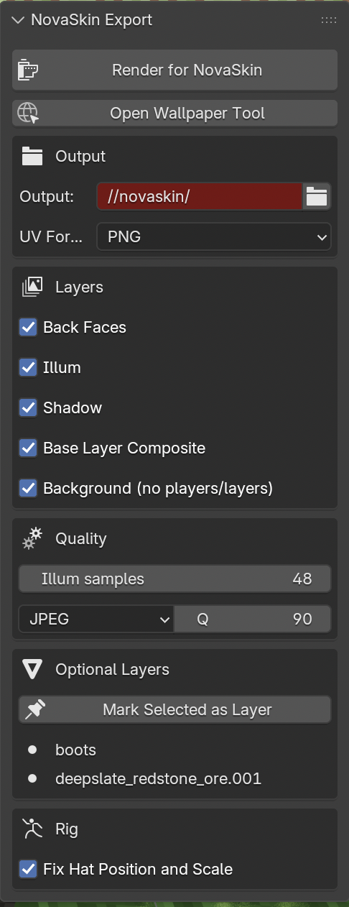

# NovaSkin Export

A Blender add-on that exports a scene built with the **Thomas Rig Legacy** Minecraft rig
as an **interactive 3D wallpaper** for the
[NovaSkin wallpaper tool](https://minecraft.novaskin.me/wallpapers/tools/blender/). The
characters ship as re-skinnable meshes with a baked light atlas, so the browser can drop
in **any skin**, relight it, switch **classic/slim** arms and toggle scenery — all live,
without re-rendering. One click renders everything the web tool needs.

  

---

## What you need

- **Blender 4.2+ with a GUI** (5.1 recommended). It does **not** run with `--background`.
- The **[Thomas Rig Legacy](https://extensions.blender.org/add-ons/thomas-rig-legacy/)**
  rig in your scene (1 or more players). Install/append it separately — the panel shows
  how many players it detects, and links to the rig if none is found.
- An **active camera** and some lights/scenery.
- A **saved `.blend`** (the output goes to a `novaskin/` folder next to it).

If something is missing, the export stops right away with a clear message instead of
failing midway.

## Install

- **Extension zip (recommended):** download `novaskin_export-<version>.zip` from the
  [releases](https://github.com/novaskin/novaskin-blender-addon/releases) and **drag it
  onto the Blender window** (or `Edit > Preferences > Get Extensions > ⌄ > Install from
  Disk…`).
- **Classic add-on:** `Edit > Preferences > Add-ons > Install…` → pick
  `novaskin_export.py`.

Then enable **“NovaSkin Export”**. Reinstall the same way to update (Install from Disk
copies the file — editing the original does not update it).

## How to use

Open the **3D Viewport sidebar** (<kbd>N</kbd>) → **NovaSkin** tab:

1. Check the **Rig** section — it lists the players detected in the scene.
2. Hit **Render**. That's it — the add-on exports the interactive **Mesh** wallpaper.
3. Use **Open Output Folder** to grab the results, and **Open Wallpaper Tool** to jump to
   the web tool and drop in a skin.

Everything also lives in the top bar under **Render → Render for NovaSkin (Mesh)**, and
scripts can call `bpy.ops.render.novaskin_static()`.

While it runs you get a progress bar in the panel (plus the viewport header and status
bar). Cancel any time with **Cancel** or <kbd>Esc</kbd> — the scene is always restored to
exactly how it was, even on cancel or error. The UI stays responsive between steps, but
each render step still blocks briefly (a Blender limitation).

### Panel options

- **Layer Options → Steps** — each export step (*Background*, *Foreground*, *Light Atlas*,
  *Shadows*, *Sprites*) has a checkbox. Turn one **off** to skip that (slow) pass and reuse
  the asset from your previous export — handy when you only need to re-render one thing.
  The geometry and `manifest.json` always run.
- **Quality** — render samples for the whole export, and the light-atlas resolution
  (*Atlas res*).
- **Output** — destination folder.
- **Rig** (Layers tab) — *Fix Hat Position and Scale* snaps the hat onto the head at the
  Minecraft proportions. The rig's own "Second layer" toggle does **not** matter: overlays
  (hat/jacket/sleeves/pants) are always exported and toggled per-part in the browser.

### Optional layers

Mark scenery you want as an **independent toggle in the wallpaper** (a mob, a tree, a
build) with the **“Mark as Optional Layer”** button:

- with objects **selected** — a selected armature (or any mesh of a rig) marks the
  **whole rig** as one layer; a plain mesh marks just itself;
- with **nothing selected** — marks the **active collection** (all its meshes become one
  layer). The panel shows which collection is active.

Each optional layer is exported so the web tool can toggle it on/off, with the shadow it
casts. Per layer you can pick how it's exported — a flat **Sprite**, a re-skinnable
**Texture** mesh, or a full **Player**. Player rigs can't be marked as layers.

### Advanced: legacy & animated exports

Two extra export modes are **off by default**; enable them under
`Edit > Preferences > Add-ons > NovaSkin Export`:

- **Legacy Texture UV export** — the classic per-part UV / occlusion-mask / light / shadow
  image export (flat images instead of a mesh). Enabling it adds a **Format** selector
  (Texture UV / Mesh) to the sidebar plus a **Render Draft** button for quick previews.
- **Animated export (experimental)** — exports the scene's frame range as an animated
  wallpaper: video passes plus the players' animated geometry (~1 MB for 15 s), re-textured
  live in the browser. Base layer only, classic arms. Needs `ffmpeg` (without it, PNG
  sequences and an `encode.sh` are left for you to run). Enabling it shows an **Animation**
  tab. ⚠️ A full export renders several passes per frame — expect it to take a while.

## What you get

A `novaskin/` folder next to your `.blend`. The **Mesh** export writes:

- `mesh.bin` + `positions.bin` — the characters' geometry (both arm variants);
- a per-character **light atlas**, **shadow** and **foreground** image;
- your **optional layers** and a **background** image;
- `manifest.json` — everything the web tool needs to put it together.

*(The legacy Texture UV export instead writes a folder per player — `player1/`,
`player2/`, … — with its UV/mask/light/shadow images, plus `layers/` and `background`.)*

Load that folder in the wallpaper tool and swap skins freely.

> **Integrating the output yourself?** The mesh format is described in
> [docs/static-mesh-plan.md](docs/static-mesh-plan.md); the legacy image format, channel
> layouts and compositing math in [docs/output-format.md](docs/output-format.md); and the
> animated pipeline in [docs/animated-export-plan.md](docs/animated-export-plan.md).

## For developers

- The whole add-on is a single file, [novaskin_export.py](novaskin_export.py); defaults
  live in its `CONFIG` block (the panel overrides the common ones).
- For heavy iteration, symlink the repo file into Blender's add-ons folder and use
  **F3 → Reload Scripts** after editing; or open it in the *Scripting* workspace and run
  it directly.
- `python3 build_addon.py` builds the extension zip; tags `v*` publish a release via CI.
